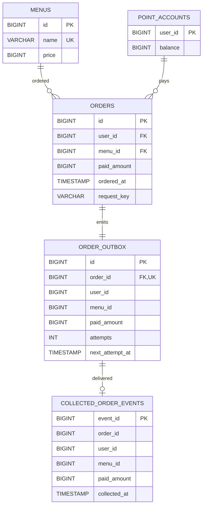

# 커피 주문 API

Java 17, Spring Boot 3.5.7, MySQL 8.4, Apache Kafka 4.1.2, Redis 7.4 기반의 서비스입니다. 메뉴 조회, 포인트 충전, 주문·결제, 최근 7일 인기 메뉴 조회를 제공합니다. 여러 애플리케이션 인스턴스가 같은 MySQL·Kafka·Redis를 사용해도 잔액과 주문 횟수가 일치하도록 설계했습니다.

## 실행

```powershell
$env:JAVA_HOME = 'C:\Program Files\Java\jdk-17'
& 'C:\Users\souls\AppData\Local\Programs\DockerDesktop\resources\bin\docker.exe' compose up -d --wait
.\gradlew.bat bootRun
```

JDK 17과 Docker가 필요합니다. 위 `JAVA_HOME` 경로는 로컬 설치 위치에 맞게 바꿉니다. Gradle Wrapper를 처음 실행할 때는 Gradle 배포 파일과 의존성을 다운로드할 인터넷 연결이 필요합니다. Compose는 개발용 MySQL, 단일 Kafka 브로커, Redis를 실행합니다. 기본 DB 주소는 `localhost:13306/coffee`, 사용자/비밀번호는 `coffee/coffee`입니다. `DB_URL`, `DB_USER`, `DB_PASSWORD`, `KAFKA_BOOTSTRAP_SERVERS`, `REDIS_HOST`, `REDIS_PORT` 환경 변수로 연결 주소를 변경할 수 있습니다. `./gradlew test` 또는 Windows에서 `.\gradlew.bat test`로 테스트합니다.

초기 메뉴는 Flyway 마이그레이션에서 4개를 등록합니다. 데모용 `compose.yaml`의 비밀번호는 운영 환경에서 교체해야 합니다.

## 패키지 구조

기능(`menu`, `point`, `order`, `analytics`)을 먼저 나누고, 각 기능 안에서 필요한 `controller`, `service`, `dto`를 구분합니다. HTTP 입력·출력은 컨트롤러가, 비즈니스 처리와 DB 트랜잭션은 서비스가 맡습니다. 요청·응답·이벤트 값은 별도 DTO로 둡니다. 사용하지 않는 계층 폴더는 만들지 않습니다.

```text
com.example.coffee
├─ CoffeeOrderApplication.java
├─ common/
│  ├─ dto/           오류 응답
│  └─ error/         공통 예외 처리
├─ config/
│  ├─ kafka/         주문 토픽 설정
│  └─ redis/         메뉴 캐시 장애 처리
├─ menu/
│  ├─ controller/    메뉴·인기 메뉴 HTTP API
│  ├─ service/       메뉴 조회·MySQL의 정확한 7일 인기 집계
│  ├─ projection/    Redis ZSET 주문 횟수 기록
│  └─ dto/           메뉴 응답 값
├─ point/
│  ├─ controller/    충전 HTTP API
│  ├─ service/       원자적 잔액 충전
│  └─ dto/           충전 요청·응답
├─ order/
│  ├─ controller/    주문 HTTP API
│  ├─ service/       결제 트랜잭션·이벤트 발행 인터페이스
│  ├─ outbox/        DB 기록을 Kafka로 발행하는 작업
│  ├─ kafka/         Kafka 전송 구현
│  └─ dto/           주문 요청·응답·이벤트
└─ analytics/
   └─ consumer/      Kafka 이벤트 수신
```

`PopularMenuService`는 MySQL 주문 내역에서 최근 7일 상위 3개를 정확히 계산하므로 `menu/service`에 둡니다. `PopularMenuZsetProjection`은 Redis ZSET에 주문 횟수를 기록하는 별도 역할이므로 `menu/projection`에 둡니다. Kafka 수신·전송과 outbox 작업도 각각 역할을 드러내는 패키지에 둡니다.

Spring Boot 시작 클래스를 상위 패키지에 두어 하위 패키지가 컴포넌트 스캔 대상이 됩니다. 주문 이벤트 DTO가 `order.dto`로 이동해 Kafka JSON 역직렬화의 신뢰 패키지도 변경했습니다. Redis에 남은 이전 메뉴 객체와 충돌하지 않도록 메뉴 캐시 이름은 `menus-v2`를 사용합니다.

## API 명세

금액은 모두 정수 원이며 `1원 = 1P`입니다. `userId`와 `menuId`는 양의 정수입니다. 모든 JSON 응답은 `ResponseEntity<T>`로 반환합니다.

| 기능 | 메서드·경로 | 입력 | 성공 응답 |
| --- | --- | --- | --- |
| 메뉴 조회 | `GET /api/menus` | 없음 | `200` 메뉴 배열 `{id, name, price}` |
| 포인트 충전 | `POST /api/points/charges` | `{userId, amount}` | `200` `{userId, balance}` |
| 주문·결제 | `POST /api/orders` | `Idempotency-Key` 헤더, `{userId, menuId}` | `201` `{orderId, userId, menuId, paidAmount, orderedAt}` |
| 인기 메뉴 | `GET /api/menus/popular` | 없음 | `200` 최대 3개 `{menuId, name, price, orderCount}` 배열 |

예시:

```http
POST /api/points/charges
Content-Type: application/json

{"userId":1,"amount":10000}
```

```http
POST /api/orders
Content-Type: application/json
Idempotency-Key: order-1

{"userId":1,"menuId":1}
```

첫 충전 때 해당 `userId`의 포인트 계정을 만듭니다. 충전액과 잔액의 상한은 각각 `1,000,000,000,000P`입니다. 메뉴가 없으면 `404 MENU_NOT_FOUND`, 잔액이 부족하거나 포인트 계정이 없으면 `409 INSUFFICIENT_POINTS`, 잔액 상한을 넘으면 `409 POINT_LIMIT_EXCEEDED`, 잘못된 JSON/필드·누락되거나 비어 있는 요청 키는 `400 INVALID_REQUEST`, 같은 사용자가 같은 키로 다른 메뉴를 요청하면 `409 IDEMPOTENCY_KEY_REUSED`입니다. 오류 본문은 `{code, message}`입니다.

`Idempotency-Key`는 주문 요청마다 클라이언트가 생성하는 1~128자 문자열입니다. 같은 사용자·키·메뉴로 재시도하면 최초 주문 응답(같은 주문 ID와 결제금액)을 `201`로 다시 반환하며 포인트와 이벤트를 다시 변경하지 않습니다. 키는 사용자별로 구분됩니다. 포인트 충전 API는 이 키를 사용하지 않습니다.

인기 메뉴는 조회 시점 기준 과거 168시간부터 현재까지 결제가 완료된 주문을 메뉴별로 집계합니다. 주문 수 내림차순, 동률이면 메뉴 ID 오름차순으로 최대 3개를 반환합니다. 주문이 없다면 빈 배열입니다.

## ERD



`orders.paid_amount`는 결제 당시 가격을 보존합니다. `collected_order_events`는 데이터 수집 플랫폼을 흉내 낸 수신 테이블이며, `event_id` 고유키로 중복 전송을 한 번만 반영합니다. 메뉴 가격이 나중에 바뀌어도 과거 주문 금액은 변하지 않습니다. `orders(ordered_at, menu_id)` 인덱스는 최근 7일 조회 범위를 좁힙니다. `orders(user_id, request_key)`의 고유 인덱스는 여러 인스턴스에 걸친 결제 요청 키 중복을 막습니다. V3 마이그레이션에서 기존 주문을 보존하기 위해 과거 행의 `request_key`는 NULL을 허용하고, 새 API 주문은 항상 키를 저장합니다.

## 설계 의도와 문제 해결 전략

1. **공유 MySQL을 정확성의 기준으로 사용합니다.** 잔액과 주문 수를 Redis에 따로 보관하면 DB와 값이 어긋날 수 있습니다. Redis는 메뉴 목록을 5분 동안 캐시하고, 최근 7일 메뉴별 주문 수를 `popular:7d:counts` ZSET에 10초마다 투영합니다. 메뉴 ID가 멤버, 주문 수가 점수이며 임시 키 작성 후 원자적으로 이름을 바꿉니다. ZSET은 10초 주기로 갱신되며 일시적으로 이전 집계를 보여줄 수 있으므로 정확한 인기 메뉴 API는 계속 MySQL을 조회합니다. Redis가 일시적으로 실패하면 메뉴 목록은 DB에서 읽습니다. 인기 메뉴는 확정된 `orders`에서 직접 `COUNT`하므로 Kafka 전송 지연이나 캐시 갱신 실패가 순위를 왜곡하지 않습니다.
2. **포인트 변경과 주문 재시도를 MySQL 행 잠금으로 직렬화합니다.** 충전은 계정 생성 후 `balance = balance + amount`, 주문은 `balance >= price` 조건이 있는 `UPDATE`로 차감합니다. 주문은 사용자 포인트 계정 행을 `FOR UPDATE`로 잠근 뒤 동일 요청 키의 기존 주문을 잠금 읽기로 확인합니다. MySQL 기본 `REPEATABLE READ`에서 일반 조회가 오래된 스냅샷을 볼 수 있어 기존 주문도 `FOR UPDATE`로 읽습니다. 같은 키·메뉴면 최초 응답을 재생하고, 다른 메뉴면 409를 반환합니다. 서버 내부 락 없이 여러 인스턴스에서 초과 차감과 중복 결제를 막습니다.
3. **잔액 차감, 주문, 전송 대기 이벤트를 한 DB 트랜잭션으로 묶습니다.** 어느 SQL이 실패해도 모두 롤백합니다. Kafka 장애가 결제를 실패시키지 않도록 토픽 발행은 커밋 후 outbox 게시기가 수행합니다.
4. **실시간 전송은 1초 간격의 outbox 폴링으로 구현합니다.** 준비된 이벤트는 곧바로 연속 처리합니다. `FOR UPDATE SKIP LOCKED`로 여러 게시 인스턴스가 같은 대기 행을 동시에 집지 않도록 합니다. 게시기는 Kafka 브로커 확인을 최대 5초 기다리고, 실패 시 5초 뒤 재시도합니다. 확인 직후 DB 커밋 전에 서버가 중단되면 중복 발행될 수 있으므로 전달 보장은 **at least once**입니다. 수집 컨슈머는 `eventId` 고유키로 중복 제거합니다.

Kafka 토픽은 `orders.paid`이며 3개 파티션을 사용합니다. 메시지 키는 `userId`, 값은 `{eventId, orderId, userId, menuId, paidAmount}` JSON입니다. 같은 사용자의 이벤트는 같은 파티션으로 보내 순서를 유지합니다. `coffee-analytics` 소비자 그룹은 한 앱 인스턴스에서 3개 컨슈머를 시작해 각 파티션을 병렬 처리합니다. 앱을 2개 띄우면 컨슈머 클라이언트는 6개가 되지만 파티션을 맡아 실제 처리하는 컨슈머는 3개입니다. 같은 `Idempotency-Key`로 주문 POST를 재시도하면 기존 주문을 반환합니다. 새 결제를 의도할 때는 새 키를 사용합니다.

## 기술 선택 이유

| 선택 | 이유 |
| --- | --- |
| Spring Boot Web + JDBC | 네 개의 단순한 API와 원자적 갱신 SQL을 명시적으로 표현하기에 충분합니다. |
| MySQL 8.4 | 행 잠금, 트랜잭션, `SKIP LOCKED`, 제약조건으로 다중 인스턴스의 공유 상태를 보호합니다. |
| Apache Kafka 4.1.2 | 주문 이벤트를 3개 파티션에 발행하고 3개 동시 컨슈머로 수집합니다. |
| Redis 7.4 | 메뉴 목록 캐시와 인기 메뉴 주문 수 ZSET 투영을 서버 간 공유합니다. 정확한 주문 횟수는 MySQL에서 읽습니다. |
| Flyway | 초기 메뉴와 스키마를 모든 인스턴스에 일관되게 적용합니다. |
| Lombok `@Builder` | 요청·응답 DTO의 생성 코드를 간결하게 유지합니다. |
| Transactional outbox | 결제 DB 커밋과 Kafka 발행 사이의 손실 위험을 줄입니다. |

MySQL의 `SKIP LOCKED` 동작은 [MySQL 8.4 SELECT 문서](https://dev.mysql.com/doc/refman/8.4/en/select.html), UTC 연결 설정은 [Connector/J 시간대 설정](https://dev.mysql.com/doc/connector-j/en/connector-j-connp-props-datetime-types-processing.html)을 기준으로 했습니다.

## 테스트와 검증 범위

`CoffeeOrderIntegrationTest`는 H2의 MySQL 호환 모드에서 API 오류, 충전과 주문, 다중 스레드의 잔액 보호·충전 누락 방지, 최근 7일 경계와 동률 순위, outbox의 발행·재시도·동시 처리 방지 및 소비자 중복 제거를 검증합니다. `KafkaOrderEventSenderTest`는 Kafka 발행 키·페이로드와 브로커 확인 실패를 검증합니다. `MenuCacheFailureTest`는 Redis 장애 때 DB 조회로 돌아가는지 확인합니다. ZSET의 7일 범위, 동일 키 재시도·동시 재시도·키 충돌·헤더 누락도 검증합니다. 총 17개 테스트가 통과했습니다.

### 실제 Docker 통합 확인 (2026-09-28)

- Compose의 MySQL 8.4, Kafka 4.1.2, Redis 7.4 컨테이너를 실행했습니다. 이 PC에서는 기존 MySQL이 3306·3307 포트를 사용하므로 프로젝트 MySQL은 호스트 `13306`에 연결합니다.
- 충전 10,000P와 4,500P 주문 후 MySQL 잔액 5,500P, Kafka 이벤트 발행, outbox 대기 0건, Redis 메뉴 캐시 키와 TTL을 확인했습니다.
- Kafka를 멈춘 상태에서도 주문이 성공하고 outbox가 남았습니다. 재시작 뒤 이벤트가 발행되고 outbox가 비워졌습니다. 이 과정에서 같은 `eventId`의 Kafka 메시지 중복을 관측했으며 수집 테이블에는 한 행만 저장됐습니다.
- 컨슈머 그룹에서 파티션 3개를 각각 맡는 컨슈머 3개를 확인했습니다. 앱 2개 인스턴스에 동시에 주문 20건을 요청한 결과 10건 결제·10건 잔액 부족, 최종 잔액 0P, 주문·수집 이벤트 각각 10건이었습니다.
- Redis 중단 중에도 두 앱 인스턴스의 메뉴 조회가 모두 200 응답과 메뉴 4개를 반환했습니다. 검증에 사용한 사용자 ID `900001`–`900003`의 기록은 개발용 MySQL 볼륨에 남아 있습니다.
- Flyway V3 적용 후 실제 MySQL에서 동일 결제 키를 재시도해 주문 ID가 같고 차감·주문·Kafka 수집이 각각 한 번인 것을 확인했습니다. 다른 메뉴에 같은 키를 쓰면 409입니다.
- 두 앱 인스턴스에 같은 키로 20건을 동시에 보내 모두 201과 같은 주문 ID를 받았고, MySQL 주문은 1건·최종 잔액은 0P였습니다. Redis ZSET은 새 주문을 반영해 메뉴 1의 점수가 13으로 갱신됐습니다. 검증 기록은 개발용 MySQL 볼륨에 남아 있습니다.
- 기능별·계층별 패키지 이동 후에도 17개 테스트가 통과했습니다. 실제 Docker 환경에서 메뉴 조회, 충전, 주문 재시도, Kafka 수집 1건·outbox 대기 0건, 새 `menus-v2::all` Redis 캐시 키를 확인했습니다.

Compose의 Kafka는 로컬 개발용 단일 브로커이며 복제 계수 1입니다. 운영 환경에서 브로커 장애까지 견디려면 다중 브로커와 복제 계수 3 이상으로 배포하고 토픽 설정을 조정해야 합니다. 사용한 Kafka 이미지 실행 방식은 [Apache Kafka Docker Quick Start](https://kafka.apache.org/41/getting-started/quickstart/), Redis 캐시 설정은 [Spring Boot Caching 문서](https://docs.spring.io/spring-boot/3.5/reference/io/caching.html)를 참고했습니다.